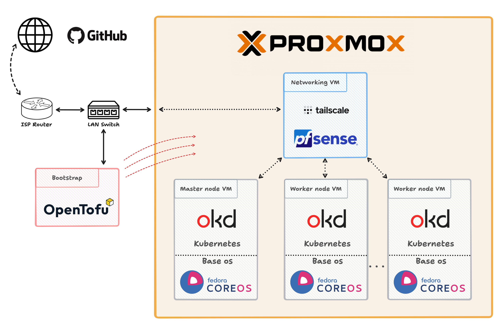

# Home Lab Infrastructure

This repository serves as a central location to track changes made to my home lab infrastructure. It includes configurations, scripts, and documentation related to managing and deploying resources on my server.

## Infrastructure Schema

## Components

### Proxmox VE

Proxmox VE is the hypervisor to manage virtualized environments, It provides a platform for deploying and managing virtual machines (VMs) and LXC containers.

### OpenTofu

OpenTofu is an IaC tool to automate the deployment of resources (VMs & LXC) on the Proxmox server. It replaces Terraform and is maintained my the Linux foundation.

### pfSense

A networking VM running pfSense is deployed on the Proxmox server to create an internal network, isolating components from the external LAN network. As Tailscale is now available directly within pfSense, i will be configuring that service.

### Fedora CoreOS

Fedora CoreOS VMs are deployed as nodes within to create a cluster. Fedora CoreOS provides a minimal, immutable operating system optimized for running containerized workloads.

### OKD (OpenShift Kubernetes Distribution)

OKD, the community distribution of OpenShift, will be configured in the Fedora CoreOS nodes and used as my environment for my various projects.